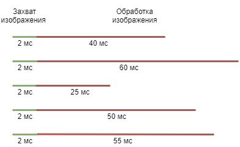
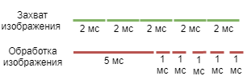
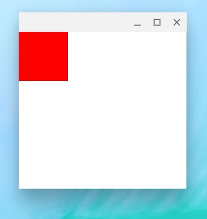
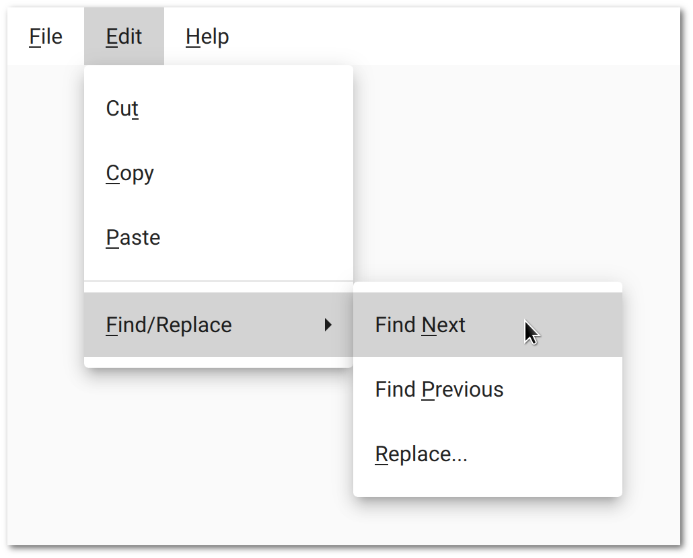
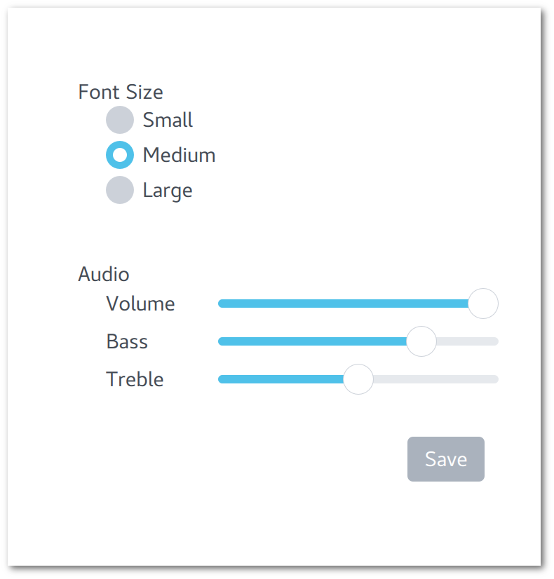

# Quite JS

> На текущий момент, практически всё программное обеспечение для
> прикладного программиста на JavaScript имеет проблему
> версионности и зависимости от интернета. Отсутствие возможности
> создания офлайн дистрибутива ограничивает сферу применения языка
> (например, оборонная промышленность), а также повышает риски при
> разработке ПО (неожиданный рефакторинг пакета в зависимостях). Примером данного
> явления является поведение фреймворка Angular2,
> проблемы с созданием self hosted приложения при программировании
> на React Native (без Expo)

## Необходимость применения очередей выполнения при проектировании высоконагруженных систем

Quite (всеобъемлющий) - инструмент скриптинга, основным отличием которого является богатая стандартная библиотека, простроенная вокруг расширений глобального объекта. Как следствие - инструмент подходит как для создания пользовательских интерфейсов, так и интеграции в посторонние программы для создания высокопроизводительной потокобезопасной очереди выполнения задач.



Изначально разрабатывался для создания очереди обработки изображений в одном коммерческом проприетарном решении, где последовательное выполнение захвата и обработки картинок мешало исполнению бизнес-логики и требовалось реализовать асинхронность этих операций. Далее было решено вынести в отдельный Open Source проект для упрощения разработки.



Очередь позволила распараллелить выполнение задач с переменной сложностью между ядрами процессора и сделать захват изображений предсказуемым во времени. Результат применения виден на графике.

## Плюсы и минусы фреймворка

PROs:

 - Свобода выбора вектора применения

    Можно как встроить в уже написанную кодовую базу (скрыв факт применения от посторонних), так и применять при разработке "С нуля". Не маловажно, если конечное решение коммерческое и проприетарное.

 - JSX factory для построения UI

    Наследует плюшки, внесенные Facebook в разработку ПО с выведением нового шаблона проектирования [FLUX](https://ru.wikipedia.org/wiki/Flux-архитектура), который можно охарактеризовать как невероятно компактный (в сравнении с MVVM или MVC). В следствие, прикладной программист допускает меньше ошибок. Об этом ниже

CONs:

 - MY_NEW_COOL_FRAMEWORK

    Как и любому новому инструменту, требуется реализовать интеграцию в среды разработки. Обычно, 99% Open Source начинаний умирают на этом этапе.

    Выше по тесту было упомянуто, что фреймворк представляет из себя высокопроизводительный JavaScript интерпретатор с расширениями глобального объекта. Сделано не просто так - благодаря этому легко создать [файл декларации TypeScript](https://www.typescriptlang.org/docs/handbook/declaration-files/library-structures.html), далее все IDE разрешат IntelliSense и auto completion автоматически.

 - Отсутствие множества уже созданных утилит под legacy методы разработки

    Как упомянуто выше, данное Open Source решение уже поддерживается внутри одного коммерческого проекта, так как является частью кодовой базы. В следствие - по мере наступления проблем: будем решать. 

## JSX factory и FLUX паттерн

Наверное, уже каждый разработчик хотя бы слышал о React и [React Native](https://facebook.github.io/react-native/). Тем не менее, я считаю, что для коммерческой разработки последний не годиться, так как уступает тому же [Flutter](https://flutter.dev/) отсутствием своего нативного backend.

```
function test() {
    return (
        <Window>
            <Rectangle color="red"/>
        </Window>
    );
}

Quite.render(test());
```

Дабы поддержать экосистему разработчика, выведенную Facebook, от натиска Google, было решено создать привязку к компонентам [Qt Quick Controls](https://doc.qt.io/qt-5/qtquickcontrols-index.html) к JavaScript интерпретатору. Когда инструмент выйдет в стабильную версию, для jsx синтаксиса будет доступны все примитивы. 



На текущий момент, поддержка построения Ui находится в статусе "пре альфа". Исполнение возможно только на Linux. Связано это с необходимостью рисовки окон на Microsoft Windows в [STA](https://docs.microsoft.com/en-us/previous-versions/dotnet/netframework-3.0/ms182351(v=vs.80)) потоке  (сейчас напрямую из фонового потока цикла событий, так как срезал угол). Тем не менее, кроссплатформенная реализация уже спроектирована и её реализации начнется в кротчайший срок.



В конечном счета, все виджеты будут портированы. Кроме того, в плане реализация диспетчера состояния (аналог [Redux](https://redux.js.org/)), встроенной системы debug утилит (аналог конфигуратора из 1C). Разработки будут вестись в этом репозитории.

